<!-- The greeter is the only thing visible until someone clicks it. -->

  

 

  

  
  
  
  

## Hi, I'm Rutwik

I'm a software engineer at **Motive** in Bangalore, working on the fuel domain of a fleet-management platform that processes millions of dollars in transactions. Most of my day is backend: Go services, Ruby on Rails, Kafka consumers, Postgres, and the on-call pager that comes with all of it.

- Currently shipping platform features end-to-end in the Fuel domain, from schema to API to Datadog dashboard
- Re-architected a core reporting pipeline into concurrent workloads with Redis caching, cutting runtime by 97% and restoring SLA adherence for a major enterprise client
- Competitive programmer: **AIR 42 at ICPC Regionals 2024**, Codeforces Expert, CodeChef 5 star
- B.Tech in Computer Science from **IIIT Surat**, 2025, CGPA 8.7
- Fun fact: I use Command over Control

## What I work with

<table>
<tr>
<td valign="top" width="50%">

**Languages**

**Backend**

**Frontend**

</td>
<td valign="top" width="50%">

**Data and messaging**

**Databases**

**Cloud and tooling**

</td>
</tr>
</table>

## Experience

**Software Engineer, Motive (formerly KeepTruckin)** · Jan 2025 – Present · Bangalore

Fuel domain of a live fleet-management platform.

- Shipped 9 platform features end-to-end in 12 months, including 3 major projects in a single month, with no critical post-launch incidents
- Built high-throughput Go ingestion pipelines with Kafka consumers, goroutines, and worker pools, turning raw fuel-transaction streams into structured, queryable data
- Re-architected a core data-processing pipeline and REST API into parallel concurrent workloads with Redis caching
- Ran a weekly on-call rotation, resolving 15+ production incidents a month and working escalations with product and support
- Automated recurring data workflows in Python across Airflow DAGs and Shoryuken queues, with Datadog dashboards and alerts on job health

**MERN Stack Developer Intern, KasperTech** · Mar 2024 – May 2024 · Remote

- Built digital form-creation and role-management modules in React, Node.js, and MongoDB for a New Zealand client, digitizing 5 government forms
- Delivered frontend features for the 5th production release, gathering requirements across 2 time zones

## Projects

**[TradeWise](https://github.com/rutwik2514/stockMarket)** — real-time stock trading simulator
Three-tier React, Node.js, and MongoDB app where users trade with virtual funds. Live market data arrives over concurrent WebSocket streams off the main thread, so prices update sub-second with no page refresh.

**[Backend Buddy](https://github.com/rutwik2514/backend-template-generator)** — backend code generator
Microservice-based RBAC generator in Node.js, Express, and MongoDB that auto-generates CRUD APIs, schemas, and permission middleware, cutting boilerplate time by 25%. An API gateway built on http-proxy-middleware puts every service behind one entry point, with parallel job queues for background work.

## Competitive programming

| Contest | Result |
| --- | --- |
| ICPC Regionals, Chennai 2024 | All India Rank 42 |
| ICPC Regionals, Amritapuri 2023 | All India Rank 95 |
| ICPC Regionals, Amritapuri 2025 | All India Rank 127 |
| Codeforces Round 902 | Rank 550 of 42,000, max rating 1629 (Expert) |
| CodeChef Starters 114 | 248th in Division 2, peak rating 2075 (5 star) |

## GitHub

  
  

  

## Reach me

Open to backend and distributed systems conversations: [rutwikdhale01@gmail.com](mailto:rutwikdhale01@gmail.com) · [LinkedIn](https://linkedin.com/in/rutwik-dhale-723272228/)

